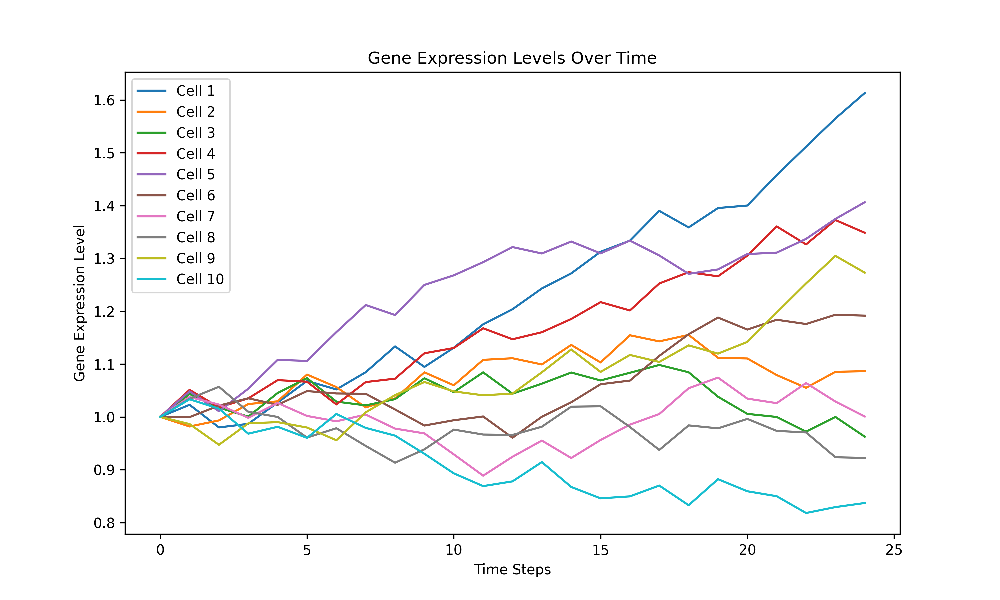

<h1 align="center">
    
</h1>

[](
https://pypi.org/project/pyorganoid/)
[](
https://anaconda.org/conda-forge/pyorganoid)
[](https://github.com/danielathome19/pyorganoid/actions/workflows/package_upload.yml)
[](https://github.com/danielathome19/pyorganoid/blob/main/LICENSE.md)
<!--[](
https://DOI_LINK_HERE)-->


Pyorganoid is the world's first<sup>*</sup> Python package for the simulation of organoids for the purpose of studying 
Organoid Intelligence (OI) and Organoid Learning (OL).
It is designed to be simple to use and easy to extend with support for standard machine
learning libraries such as TensorFlow, PyTorch, and Scikit-Learn (as well as ONNX-format models).

<!-- - **Website:** https://danielathome19.github.io/pyorganoid/ -->
- **Documentation:** https://danielathome19.github.io/pyorganoid/docs/
- **Source code:** https://github.com/danielathome19/pyorganoid
- **Contributing:** [CONTRIBUTING.md](CONTRIBUTING.md)
- **Bug reports:** https://github.com/danielathome19/pyorganoid/issues

It provides:

- a simple and intuitive API
- support for standard machine learning libraries
- a growing library of organoid models
- visualization tools for organoid simulation
- numerous simulation environments and scheduling algorithms
- TODO: *support for parallel/distributed computing, bio/cheminformatics libraries, logging, and more*

Pyorganoid is currently in development and may not yet be ready for production use. We are actively seeking contributors
to help us improve the package and expand its capabilities. If you are interested in contributing, please see our
[contributing guide](CONTRIBUTING.md).

<p style="font-size: 6px"><sup>*</sup>As of July 6th, 2024, to the best of our knowledge :)</p>


## Installation


### Pip

Pyorganoid can be installed (without built-in support for machine learning libraries) using `pip`:

```bash
pip install pyorganoid
```

To include support for all machine learning libraries, use:

```bash
pip install pyorganoid[all]
```

Or, to include support for a specific library (TensorFlow, PyTorch, Scikit-Learn, or ONNX), use:

```bash
pip install pyorganoid[tensorflow]
pip install pyorganoid[torch]
pip install pyorganoid[sklearn]
pip install pyorganoid[onnx]
```


### Conda

Pyorganoid can also be installed using `conda`:

```bash
conda install -c conda-forge pyorganoid
```

To include support for all machine learning libraries, use:

```bash
conda install -c conda-forge pyorganoid-all
```

Or, to include support for a specific library (TensorFlow, PyTorch, Scikit-Learn, or ONNX), use:

```bash
conda install -c conda-forge pyorganoid-tensorflow
conda install -c conda-forge pyorganoid-torch
conda install -c conda-forge pyorganoid-sklearn
conda install -c conda-forge pyorganoid-onnx
```


## Quickstart

For a quick introduction to Pyorganoid, see the [Spiking Neuron Test](tests/spiking_test.py) in the `test` directory.
This test demonstrates the creation of a simple spiking neuron organoid running a binary classification Multi-Layer
Perceptron (MLP) model using TensorFlow.

If you prefer Scikit-Learn, PyTorch, or ONNX models, see the [Volumetric Organoid Test (Scikit-Learn)](tests/growshrink_test.py),
the [Gene Regulation Organoid Test (PyTorch)](tests/generegulation_test.py), or
the [Immune Response Organoid Test (ONNX)](tests/immune_test.py), respectively.


<table style="width:100%;">
<tr>
    <td>
        
    </td>
    <td>
            
    </td>
</tr>
<tr>
    <td>
        
    </td>
    <td>
            
    </td>
</tr>
</table>

## License

Pyorganoid is licensed under the BSD-3 License. See the [LICENSE](LICENSE.md) file for more information.

<!-- Project development began July 6th, 2024. -->
